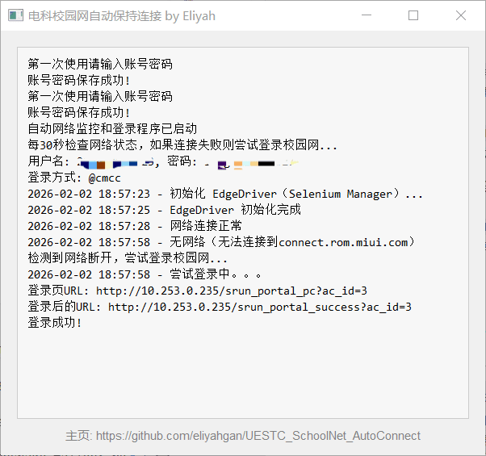

# UESTC_SchoolNet_AutoConnect

电科校园网自动保持连接小工具。程序会每 30 秒检测联网状态，断网时自动尝试登录；提供系统托盘与控制台窗口，首次运行可保存账号密码，并选择登录方式（移动/电信）。

## 运行截图


## 功能特性
- 断网自动登录（Selenium + Edge）
- 首次登录可选择登录方式，后续默认使用
- 后台常驻与系统托盘
- 控制台日志窗口
- 账号密码与登录方式保存到本地配置文件

## 运行环境
- Windows
- Python 3.8+
- Microsoft Edge（系统自带或已安装）
- Selenium Manager（Selenium 4.6+，自动匹配驱动）

## 安装依赖
在项目目录执行：

```
pip install -r requirements.txt
```

## 使用方法
1. 运行程序：

```
python main.py
```

2. 启动时会自动初始化并下载/缓存匹配的 EdgeDriver（Selenium Manager）。
3. 首次运行弹窗输入账号密码并选择登录方式，保存后自动开始监测。
4. 程序启动后在系统托盘运行，可从托盘菜单打开控制台或退出。

> 说明：首次启动时 Selenium Manager 会在后台自动下载并缓存匹配的 EdgeDriver。Windows 常见缓存目录：
> `C:\Users\<用户名>\AppData\Local\Selenium\`

## 配置文件
程序会在同路径生成并读取：

```
UESTC_AutoConnect_config.ini
```

其中包含账号与密码（明文）以及登录方式。**如需恢复出厂设置，请删除该配置文件**。

## 打包（可选）
已提供 PyInstaller 配置：

```
pyinstaller main.spec
```

## 注意事项
- 请确保校园网登录页面地址可访问（默认：`http://10.253.0.235/srun_portal_pc?ac_id=3`）。
- 首次运行需要联网以便 Selenium Manager 下载驱动，之后可离线运行。
- 若页面需要验证码，自动登录会失败（需人工处理）。

## 免责声明
仅供学习与个人使用，请遵守校园网相关规定。